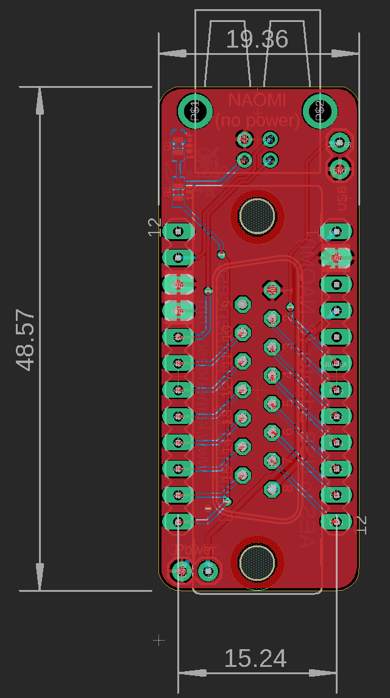

# Tested

The code was tested on a prototype board by Stefano Minozzi (cyllboy).

Freel free to contact for questions about code and board.

# IONA - JVS IO Board by Arduino Pro Micro

Original code by [Takashi Toyoshima](https://github.com/toyoshim).

This program makes an Arduino Nano work as a JVS IO Board that allows you to connect a legacy JAMMA joystick to a JVS based arcade system, such as NAOMI.

Since now underlying [jvsio](https://github.com/toyoshim/jvsio) library supports several boards and devices, you would be able to run this on other boards with minimal hacks.

Also there is [another example](https://github.com/toyoshim/iona-js) to run iona compatible functionalities without the Arduino firmware.


## Schematic

This program makes an Arduino Pro Micro work as a JVS IO Board that allows youto connect a legacy AES compatible joystick gamepad (included Button 5 and 6 for customomized arcade sticks.

Since now underlying [jvsio](https://github.com/toyoshim/jvsio) library supports several boards and devices, you would be able to run this on other boards with minimal hacks.

Also there is [another example](https://github.com/toyoshim/iona-js) to run iona compatible functionalities without the Arduino firmware.

Resistor (R1) and capacitor (C1) are 100Ohm and 100nF 0603 SMD.

The PCB is based in this DB15 AES compatible pinout:
```
.----------------------------------------------------------------.
\ 1:GND   2:B6    3:CDT   4:B4    5:B2    6:RGH   7:DWN   8:+5V  /
 \                                                              /
  \  9:NC   10:B5   11:STR    12:B3   13:B1   14:LFT    15:UP  /
    `---------------------------------------------------------´
```
The Board  has a jumper, if it's shorted then it works as a USB Stick for a computer, using the micro USB of Arduino., else it works aas a JVS for the naomi using the USB B connector.

In JVS mode, the Naomi's USB doesn't give power to the board, use the micro USB connector or the power jumpers on the board (See legend on the back side of the PCB). You can get 5V from CN7 on the Naomi Board.
```
 _________________
| 5V  5V  GND GND |   CN7
 ¯¯¯¯¯¯¯¯¯¯¯¯¯¯¯¯¯
```
## Board (PCB)



Note: JVS uses the USB connector, but it isn't the real USB at all.
The protocol is completely different, and it does not provide the 5V power.
